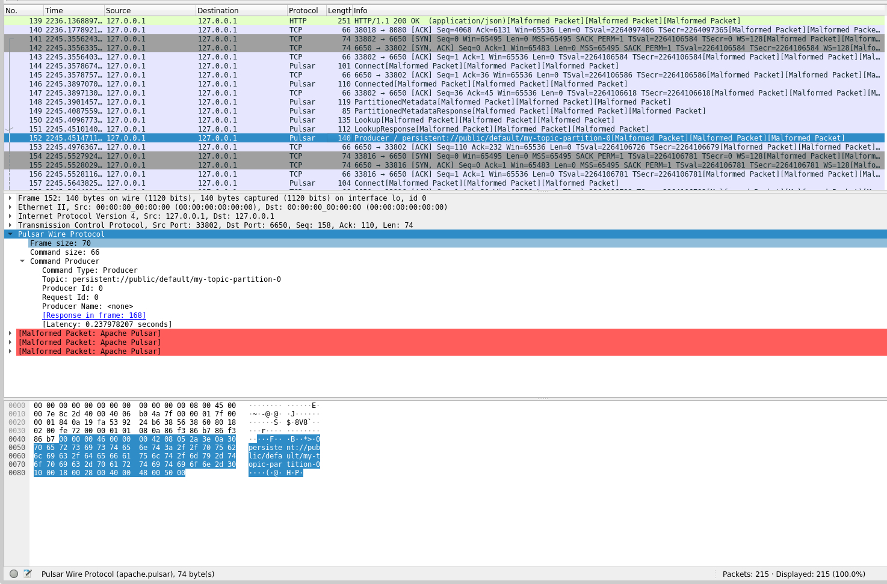
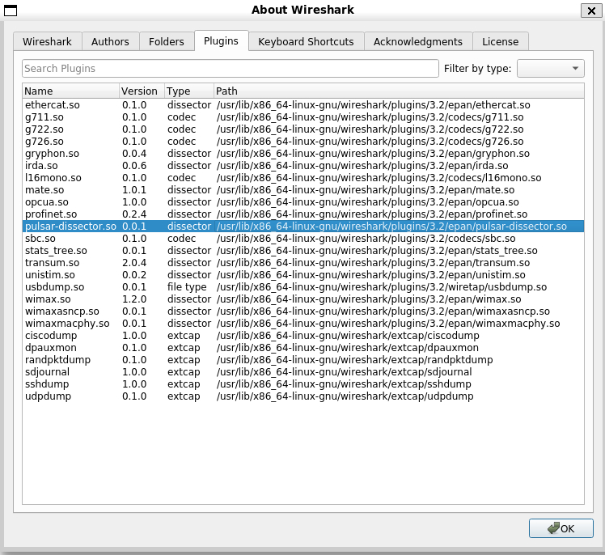

<!--

    Licensed to the Apache Software Foundation (ASF) under one
    or more contributor license agreements.  See the NOTICE file
    distributed with this work for additional information
    regarding copyright ownership.  The ASF licenses this file
    to you under the Apache License, Version 2.0 (the
    "License"); you may not use this file except in compliance
    with the License.  You may obtain a copy of the License at

      http://www.apache.org/licenses/LICENSE-2.0

    Unless required by applicable law or agreed to in writing,
    software distributed under the License is distributed on an
    "AS IS" BASIS, WITHOUT WARRANTIES OR CONDITIONS OF ANY
    KIND, either express or implied.  See the License for the
    specific language governing permissions and limitations
    under the License.

-->

# Pulsar Wireshark dissector

The Pulsar Wireshark dissector allows to automatically decode the Pulsar binary protocol
and visualize useful debug information (linking requests with responses, latency stats, etc.)



There is also [a dissector written in Lua](https://github.com/apache/pulsar/tree/master/wireshark), which only supports Wireshark before 4.0.

To install the Wireshark, see [the official documents](https://www.wireshark.org/) for details.

## How to use

### Install dependencies

- macOS

```shell
$ brew install pkg-config wireshark protobuf
```

- Ubuntu

```shell
$ sudo apt install protobuf-compiler libprotobuf-dev wireshark-dev
```

### Build from source

Run the following commands in this subdirectory.

```shell
cmake -B build
cmake --build build
```

Then the `pulsar-dissector.so` plugin will be created under the `build-wireshark` directory.

> **NOTE**:
>
> If `cmake -B build` cannot find the `WIRESHARK_INCLUDE_PATH`, you have to provide the path manually by adding the `-DWIRESHARK_INCLUDE_PATH=/path/to/wireshark/include` option.

### Copy to the plugin directory

1. Run the Wireshark and click the menu **Help - About Wireshark - Plugins**, and then you can find the plugin directory. For example, it's `/usr/lib/x86_64-linux-gnu/wireshark/plugins/3.2/epan` on Ubuntu 20.04. Then, copy the dissector into that directory:

2. Copy the dissector into that directory.

```bash
sudo cp ./build/pulsar-dissector.so /usr/lib/x86_64-linux-gnu/wireshark/plugins/3.2/epan/
```

To verify whether it has been loaded successfully, restart the Wireshark and then you can see the plugin in the plugin list:


